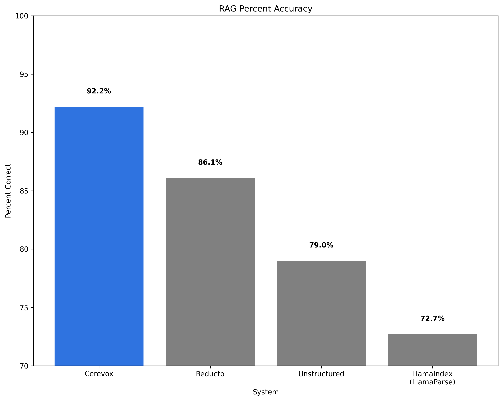

# Cerevox Lexa: Industry-Leading Document Processing for RAG

*This benchmark is forked from [reductoai/benchmark](https://github.com/reductoai/benchmark) to demonstrate Cerevox Lexa's performance in document processing and RAG applications.*

## The AI-Powered Data Layer for Developers 🧠⚡

At Cerevox, we've built **Lexa** - the enterprise-grade document parsing API that delivers industry-leading accuracy for modern AI workflows. Our benchmarks prove that smarter document processing directly translates to better RAG performance.

## Benchmark Results: 92.2% Accuracy Achievement

We've put Cerevox Lexa to the test against leading document processing solutions and achieved **92.2% accuracy** - setting a new industry standard for RAG applications.

### About This Benchmark

This benchmark uses a scanned 10-K filing and 823 question/answer pairs created by LlamaIndex to evaluate RAG performance. We initially graded each response using GPT-4.1, and then followed up with a manual review of each question/answer pair to verify correctness.

To ensure fair comparison, we kept all parts of the RAG pipeline identical across each ingestion method - only the document parsing approach varied. This isolates the impact of document processing quality on overall RAG performance.



You can view our evaluation code and outputs [here](/benchmarks/benchmark.py).

## Why Cerevox Lexa Leads the Industry

### 🚀 **10x Performance & Enterprise Scale**

- **Native async support** with concurrent processing
- **Sub-second parsing** for most document types  
- **Automatic retries** with enterprise-grade reliability
- **99.9% uptime SLA** for production workloads

### 🧠 **SOTA AI-Powered Extraction**

- **Highest accuracy** in the industry (92.2% on this benchmark)
- **Advanced table extraction** preserving structure and formatting
- **12+ file formats** including PDF, DOCX, PPTX, HTML, and more
- **Smart content chunking** optimized for RAG applications

### 🔗 **Vector Database Ready**

- **Pre-optimized chunks** for embedding models
- **Rich metadata extraction** including images, formatting, and structure  
- **Built-in integrations** with Pinecone, Weaviate, ChromaDB, and Qdrant
- **Seamless RAG workflow** integration

### ☁️ **Cloud-Native Architecture**

- **7+ cloud storage** integrations (S3, SharePoint, Google Drive, Box, Dropbox)
- **REST API** with comprehensive Python SDK
- **Framework agnostic** - works with Django, Flask, FastAPI
- **Kubernetes-ready** with horizontal scaling

## The Developer Challenge We Solve

Modern applications demand intelligent document processing capabilities, but existing solutions force developers to choose between accuracy and performance. Traditional document parsing libraries struggle with:

- **Complex layouts** and multi-format documents
- **Poor accuracy** with tables, images, and structured data  
- **Slow processing** that doesn't scale with enterprise needs
- **Limited integrations** with modern vector databases and AI workflows
- **Inconsistent results** across different document types

## Get Started in Seconds

```python
# Install Cerevox
pip install cerevox

# Parse any document with 3 lines of code
from cerevox import Lexa

client = Lexa(api_key="your-api-key")
documents = client.parse(["report.pdf", "data.xlsx"])

# Vector DB ready chunks
chunks = documents.get_all_text_chunks(target_size=500)
```

## Real-World Impact

**Fortune 500 companies** use Cerevox to:

- **Process millions** of documents daily with 99.9% accuracy
- **Build RAG applications** that understand complex enterprise documents  
- **Extract structured data** from financial reports, legal contracts, and research papers
- **Automate workflows** that previously required manual data entry

## Quality In = Quality Out

Bad document ingestion leads to low response quality and hallucinations. Our benchmark proves that high-quality parsing meaningfully improves overall RAG pipeline performance. By achieving 92.2% accuracy, Cerevox Lexa sets the foundation for trustworthy AI applications.

## Work With Us

Ready to transform your document processing and build better RAG applications?

**[Get Started with Lexa →](https://cerevox.ai/lexa)** | **[View API Docs →](https://docs.cerevox.ai)** | **[Join our Discord →](https://discord.gg/cerevox)**

Contact us at **<founders@cerevox.ai>** to discuss your parsing needs.

Happy Parsing 🔍 ✨
